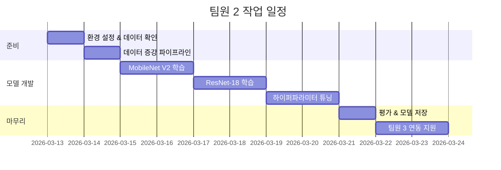

# 🧠 팀원 2 (모델 엔지니어) 작업 계획

## 전제 조건

> 팀원 1이 **전처리된 224x224 이미지 데이터셋**(train/val/test 분할, seed=42)을 제공한 이후 본격적으로 시작합니다.

---

## Phase 1: 환경 설정 & 데이터 확인

| 항목 | 내용 |
|---|---|
| **목표** | 학습 환경 구축, 전처리된 데이터 정상 로딩 확인 |
| **완료 기준** | DataLoader로 배치 이미지를 정상 출력 |

### 할 일

1. `requirements.txt`에 필요한 패키지 추가 (PyTorch, torchvision, etc.)
2. 로컬 환경에서 PyTorch 설치 확인 및 GPU/CPU 자동 설정 코드 작성
3. `ImageFolder` + `DataLoader`로 train/val/test 데이터 로딩 확인
4. 클래스별 이미지 수, 샘플 이미지 시각화로 데이터 상태 점검

---

## Phase 2: 데이터 증강 파이프라인 구축

| 항목 | 내용 |
|---|---|
| **목표** | 600장의 데이터 한계를 극복하기 위한 학습 시 실시간 증강 |
| **완료 기준** | 증강된 샘플 시각화하여 다양성 확인 |

### 할 일 (협업.md 합의에 따라 On-the-fly 증강 담당)

1. **학습용 Transform 정의:**
   ```python
   train_transform = transforms.Compose([
       transforms.RandomHorizontalFlip(),
       transforms.RandomRotation(15),
       transforms.ColorJitter(brightness=0.2, contrast=0.2, saturation=0.2),
       transforms.RandomResizedCrop(224, scale=(0.8, 1.0)),
       transforms.ToTensor(),
       transforms.Normalize(mean=[0.485, 0.456, 0.406],
                            std=[0.229, 0.224, 0.225]),
   ])
   ```
2. **검증/테스트용 Transform 정의** (증강 없이 정규화만):
   ```python
   val_transform = transforms.Compose([
       transforms.ToTensor(),
       transforms.Normalize(mean=[0.485, 0.456, 0.406],
                            std=[0.229, 0.224, 0.225]),
   ])
   ```
3. 증강 전/후 이미지 비교 시각화

---

## Phase 3: 모델 개발 (순차적으로 진행)

| 항목 | 내용 |
|---|---|
| **목표** | 전이 학습 기반 딥러닝 모델로 정확도 85% 이상 달성 |
| **완료 기준** | Validation Accuracy ≥ 85%, 실험 결과 Notion 기록 |

### Step 3-1: MobileNet V2 (경량 모델, 먼저 실험)

- **이유:** 경량 모델로 전체 파이프라인 검증 + CPU 추론 속도 유리
- pretrained MobileNet V2 로드 → 마지막 FC 레이어를 4-class 출력으로 교체
- 로컬에서 1~2 epoch Sanity Check → 이상 없으면 본 학습 진행

### Step 3-2: ResNet-18 (중간 모델)

- pretrained ResNet-18 로드 → FC 레이어 교체
- MobileNet과 성능 비교

### Step 3-3: ResNet-50 (고성능 모델, 필요 시)

- 더 높은 정확도가 필요할 경우에만 진행
- GPU 환경 권장 (CPU에서도 학습 가능하나 시간 소요 큼)

### 공통 학습 설정

| 항목 | 값 |
|---|---|
| Optimizer | Adam (lr=1e-4) |
| Loss | CrossEntropyLoss |
| Epochs | 20~30 (Early Stopping 적용) |
| Batch Size | 32 |
| Scheduler | ReduceLROnPlateau 또는 CosineAnnealing |

---

## Phase 4: 하이퍼파라미터 튜닝 & 과적합 방지

| 항목 | 내용 |
|---|---|
| **목표** | 최적 성능 도출, 과적합 방지 |
| **완료 기준** | Train-Val Loss 갭이 안정적, 성능 개선 확인 |

### 할 일

1. **과적합 방지 기법 적용:**
   - Dropout (FC 레이어)
   - Early Stopping (patience=5)
   - Weight Decay (L2 Regularization)
2. **하이퍼파라미터 조정:**
   - Learning Rate: 1e-3 ~ 1e-5 범위 탐색
   - Batch Size: 16 / 32 비교
   - Augmentation 강도 조절
3. **학습 곡선(Train/Val Loss, Accuracy) 시각화 및 분석**
4. 모든 실험 결과를 **Notion 실험 기록표**에 기록

---

## Phase 5: 평가 & 모델 저장

| 항목 | 내용 |
|---|---|
| **목표** | 최종 모델 선정 및 평가 리포트 작성 |
| **완료 기준** | Test Set 평가 완료, `.pth` 파일 팀에 공유 |

### 할 일

1. **Test Set 평가 (협업.md 합의 지표 기준):**
   - Accuracy, F1-Score (Macro), Precision, Recall
   - Confusion Matrix 생성 → 오분류 패턴 분석
2. **추론 속도 측정:**
   - 전처리 + 추론 전체 파이프라인 시간 (CPU 환경)
   - 목표: 1초 이내
3. **모델 저장 (네이밍 규칙 준수):**
   - 형식: `[모델명]_ep[에폭]_acc[검증정확도]_[MMDD].pth`
   - 예: `mobilenetv2_ep25_acc91_0315.pth`
4. **`.pth` 파일을 팀 공유 폴더에 공유** → 팀원 3에게 전달
5. **출력 형태 확인** (협업.md 인터페이스 규격 준수):
   - 입력: `(B, 3, 224, 224)` Tensor
   - 출력: `(B, 4)` Softmax 또는 Logits

---

## Phase 6: 팀원 3 연동 지원

| 항목 | 내용 |
|---|---|
| **목표** | 모델이 Gradio/Streamlit 앱에서 원활히 동작하도록 지원 |
| **완료 기준** | 웹캠 앱에서 정상 추론 확인 |

### 할 일

1. 모델 로드 + 단일 이미지 추론 예제 코드 제공
2. 클래스 매핑 딕셔너리 공유: `{0: 'unripe', 1: 'ripe', 2: 'overripe', 3: 'dispose'}`
3. 팀원 3과 함께 앱 연동 테스트 및 버그 수정

---

## 작업 타임라인 (요약)


